# CONSULTA 1 

## Selecciona las columnas film_id y title de la tabla film.

 ```SELECT film_id, title FROM film;```

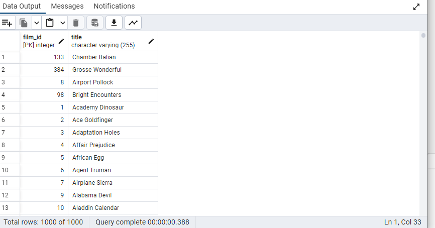


# CONSULTA 2

## Selecciona 5 filas de la tabla film, obteniendo todas las columnas.

` SELECT * FROM film LIMIT 5; `

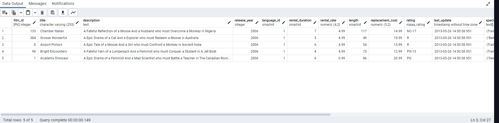

# CONSULTA 3 

## Selecciona filas de la tabla film donde film_id sea menor que 4.

` SELECT * FROM film  WHERE film_id<4; `

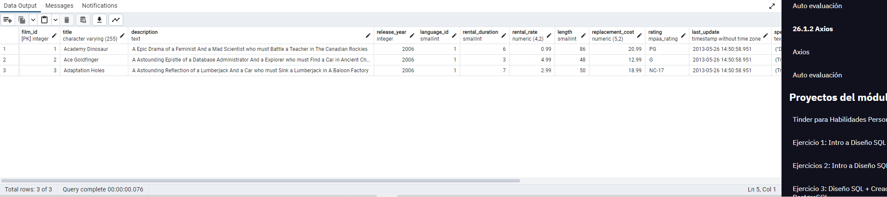


# CONSULTA 4 

## Selecciona filas de la tabla film donde el rating sea PG o G.

` SELECT * FROM film WHERE rating='PG' OR rating='G'; `

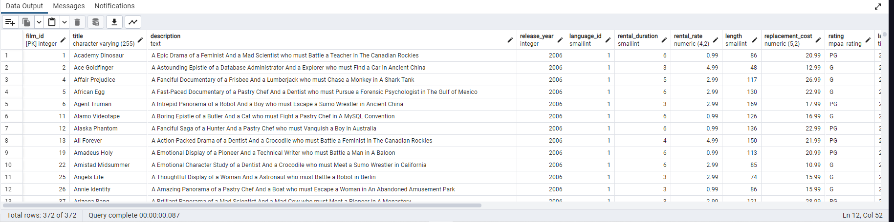


# CONSULTA 5 

## Selecciona filas de la tabla actor donde el nombre sea Angela, Angelina o Audrey usando IN.

` SELECT * FROM actor WHERE first_name IN ('Angela','Angelina','Audrey'); `

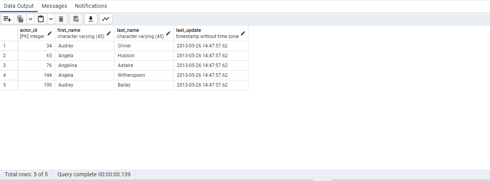

# CONSULTA 6

## Obtén una lista de actores con el nombre Julia.

`SELECT * FROM actor WHERE first_name= 'Julia'; `

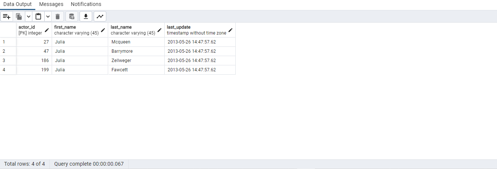

# CONSULTA 7

## Obtén una lista de actores con los nombres Chris, Cameron o Cuba.

` SELECT * FROM actor WHERE first_name IN ('Chris','Cameron','Cuba'); `

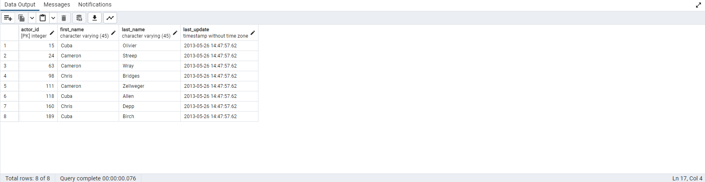


# CONSULTA 8

## Selecciona la fila de la tabla customer para el cliente con el nombre Jamie Rice.

` SELECT * FROM customer WHERE last_name LIKE 'Rice'; `

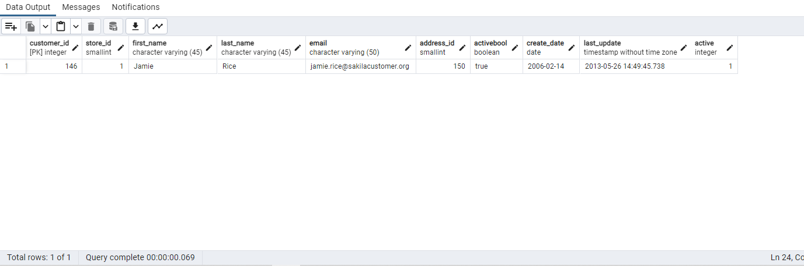

# CONSULTA 9

## Selecciona el monto y la fecha de pago de la tabla payment donde el monto pagado sea menor a $1.

` SELECT amount,payment_date FROM payment WHERE amount <=1; `

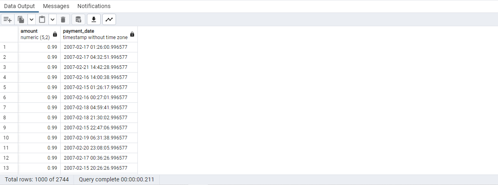


# CONSULTA 10

## ¿Cuáles son las diferentes duraciones de alquiler permitidas por la tienda?

`SELECT DISTINCT rental_duration FROM film ORDER BY rental_duration; `

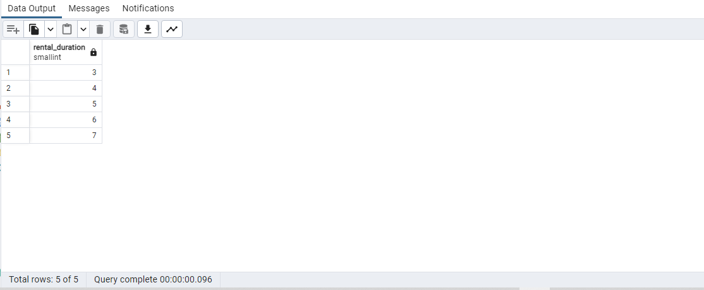


# CONSULTA 11

## Ordena las filas en la tabla city por country_id y luego por city.

` SELECT * FROM city ORDER BY country_id, city; `

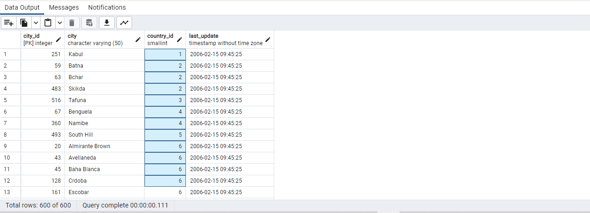


# CONSULTA 12

## ¿Cuáles son los ID de los últimos 3 clientes que devolvieron un alquiler?

` SELECT *  FROM rental WHERE return_date IS NOT NULL ORDER BY return_date DESC LIMIT 3; `

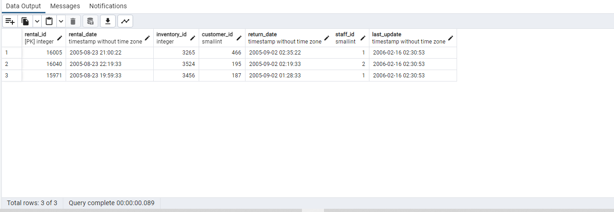


# CONSULTA 13

## ¿Cuántas películas tienen clasificación NC-17? ¿Cuántas tienen clasificación PG o PG-13?

` SELECT COUNT (rating) AS cantidad_NC17 FROM film WHERE rating= 'NC-17'; `

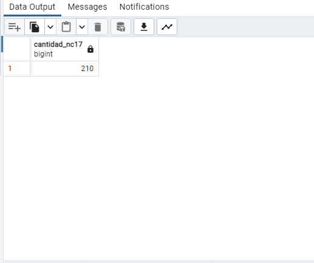

` SELECT COUNT (rating) AS cantidad_pg_pg13 FROM film WHERE rating= 'PG' OR  rating= 'PG-13' ; `

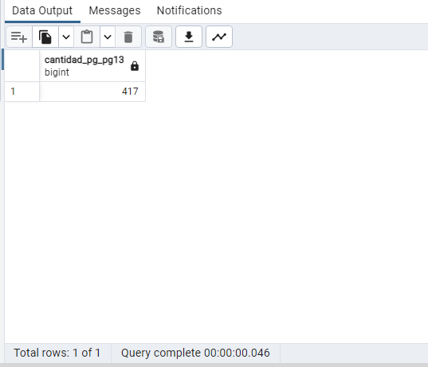


# CONSULTA 14 

## ¿Cuántos clientes diferentes tienen registros en la tabla rental?

` SELECT COUNT (DISTINCT customer_id) FROM rental; `

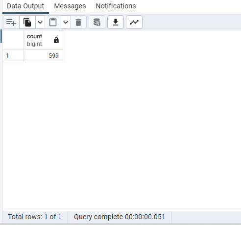


# CONSULTA 15


## ¿Hay algún cliente con el mismo apellido?

` SELECT last_name,COUNT(*) FROM customer GROUP BY  last_name HAVING COUNT(*)>1;  `

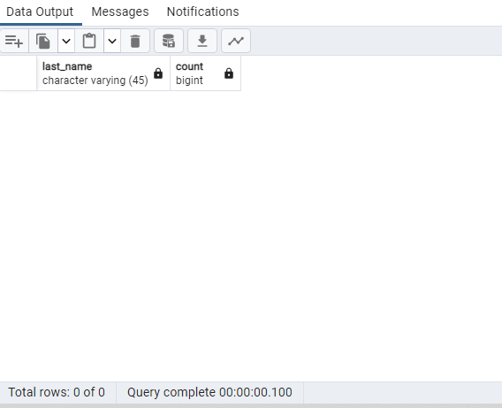


# CONSULTA 16

## ¿Qué película (id) tiene la mayor cantidad de actores?


` SELECT film_id, COUNT(actor_id) as actor_count FROM film_actor
GROUP BY film_id
ORDER BY actor_count DESC
LIMIT 1; `


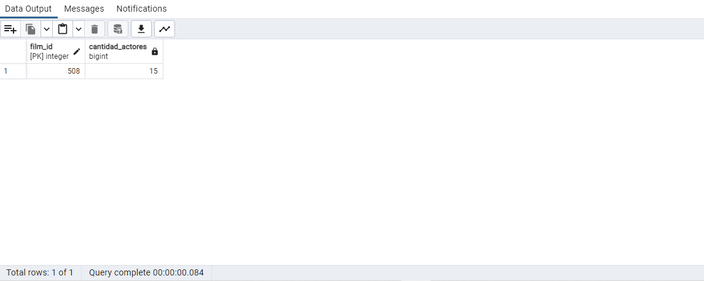


# CONSULTA 17


## ¿Qué actor (id) aparece en la mayor cantidad de películas?


` 
SELECT actor_id, COUNT(film_id) AS film_count FROM film_actor
GROUP BY actor_id
ORDER BY film_count DESC LIMIT 1; `


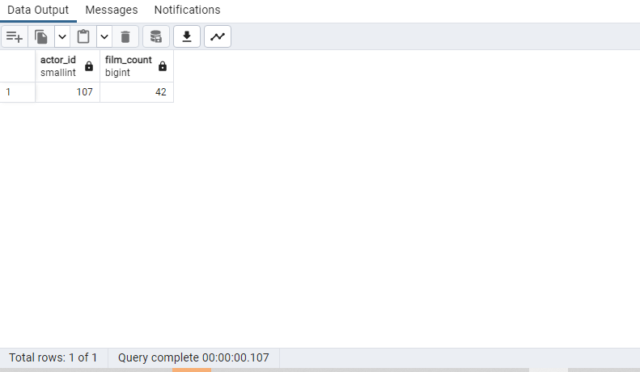


# CONSULTA 18

## Cuenta el número de ciudades para cada country_id en la tabla city. Ordena los resultados por count(*).


` SELECT country_id, COUNT(city)  FROM city GROUP BY country_id; `


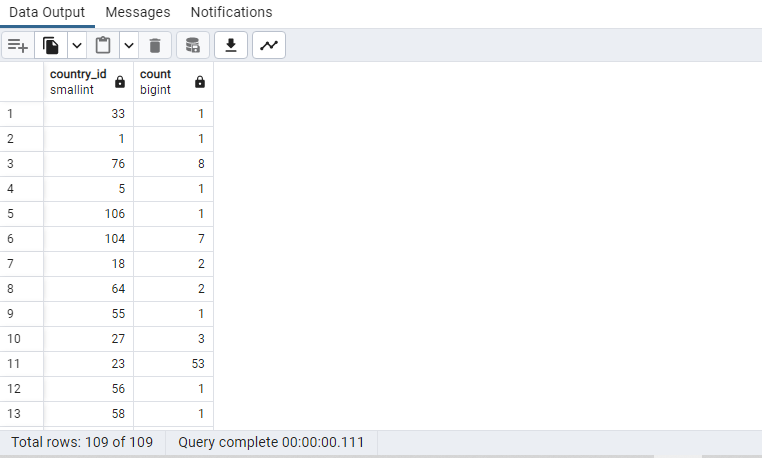


# CONSULTA 19

# ¿Cuál es la tarifa de alquiler promedio de las películas? ¿Puedes redondear el resultado a 2 decimales?

` SELECT  ROUND(AVG(rental_rate),2) AS rental_rate_avg FROM film; `


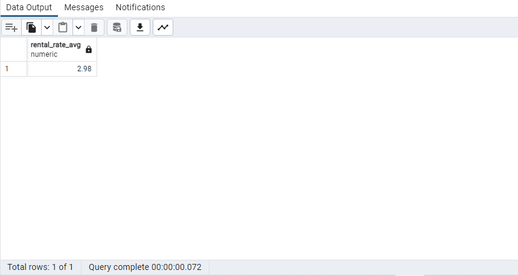


# CONSULTA 20

## Selecciona los 10 actores que tienen los nombres más largos (nombre y apellido combinados).


` SELECT first_name, last_name,  LENGTH(first_name || last_name) AS full_name_size
FROM actor
ORDER BY full_name_size DESC
LIMIT 10; `


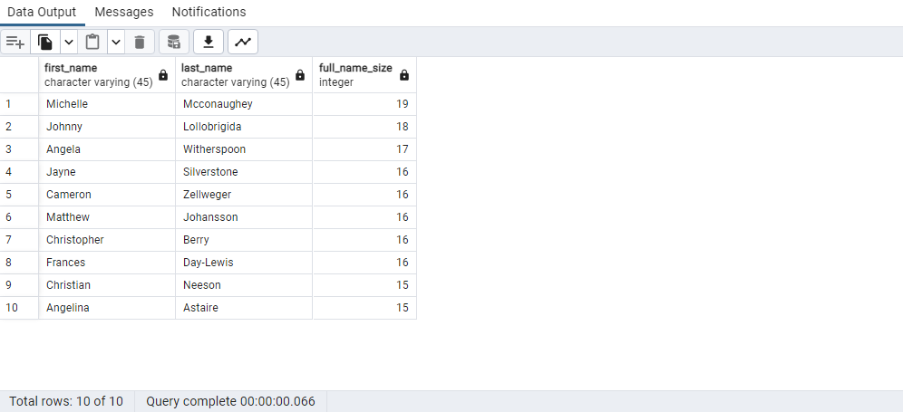
